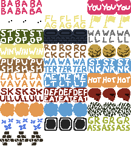
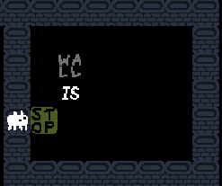
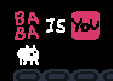
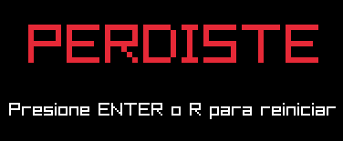
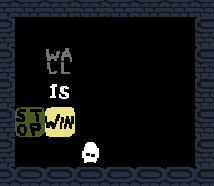
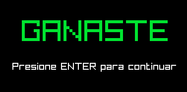

# Directorio del proyecto programado 3

## Descripción del directorio

Directorio dentro del repositorio de control de versiones del curso CI-0113
para el tercer proyecto de Programación 2: BABA IS YOU.

## Descripción del problema

Baba is You es un juego de rompecabezas donde las reglas del juego son manipulables como objetos dentro del nivel. El jugador controla al personaje Baba (u otros objetos, dependiendo de las reglas) y debe alcanzar la meta normalmente representada por un objeto Flag. La mecánica central es que las reglas (ej. "Baba is You", "Wall is Stop", "Flag is Win") están escritas en bloques de texto que pueden ser empujados, modificando así las reglas del nivel en tiempo real.

El desafío principal es diseñar un motor de juego que:

1. Interprete las reglas dinámicamente.
2. Permita la interacción con bloques de texto y objetos.
3. Valide condiciones de victoria/derrota según las reglas activas.

Ejemplo de jugabilidad en: [Is Baba is You for You?](https://www.youtube.com/shorts/_D46WqC7tKg)

## Manual del desarrollador

El proyecto está dividido en 2 carpetas principales:

1. **La carpeta `assets`**: contiene las subcarpetas `data` e `images`. En `data` se almacenan los primeros 8 niveles del juego, modelados en formato `.txt`. Por otro lado, la carpeta `images` contiene `baba.png`, una imagen compuesta que muestra 3 sprites de cada elemento del juego, pensada para facilitar la animación de los objetos.


2. **La carpeta `src`**: contiene todos los archivos fuente del proyecto en c++. Aquí se encuentran definidas las clases principales del juego como Game, Level, Utilities, Structures y Config.

   - `main.cpp`: contiene el punto de entrada del programa.
   - `Game.cpp` y `Game.hpp`: definen la lógica principal del ciclo de juego.  
   - `Level.cpp` y `Level.hpp`: se encargan de la carga, gestión y representación de los niveles.  
   - `Utilities.cpp` y `Utilities.hpp`: agrupan funciones auxiliares y herramientas comunes.  
   - `Structures.hpp`: define estructuras de datos compartidas entre los distintos componentes.  
   - `Config.hpp`: centraliza configuraciones globales como el tamaño de la ventana y los FPS.

## Compilación y ejecución del juego

El proyecto posee un makefile que ofrece varios comandos para permitir una compilación y ejecución más simple, basta con realizar el siguiente comando desde la raiz del proyecto:

`make clean; make; make run`

Esta instrucción va a desplegar la ventana donde se podrá jugar el Baba is You

Además se puede realizar la verificación del linter mediante el comando
`make lint`

## Manual de usuario

| **Teclas para jugar** | **¿Qué hacen?** |
|---|---|
| **Tecla de dirección: arriba**  | Mueve el personaje hacia el norte en el mapa.  |
| **Tecla de dirección: abajo** | Mueve el personaje hacia el sur en el mapa. |
| **Tecla de dirección: derecha** | Mueve el personaje hacia el este en el mapa. |
| **Tecla de dirección: izquierda** | Mueve el personaje hacia el oeste en el mapa. |
| **Tecla "R"** | Reinicia la partida completamente. |
| **Tecla "Z"** | Deshace el último movimiento dado por el jugador. |

El jugador será capaz de mover objetos a su alrededor en las cuatro direcciones, bajo ciertas condiciones las cuales a su vez pueden ser construidas por bloques de reglas. El formato que estas deben seguir es el siguiente: **objeto**, **is**, **verbo**. Como por ejemplo "Rock is push", que permite empujar una roca.


Además, es posible destruir reglas de objetos que bloquean ciertas acciones al jugador. Por ejemplo, en la regla "Wall is Stop", el jugador estará encerrado. Mas si se desarma esa regla, será posible atravesar las paredes.


El juego se pierde si la regla que le da identidad al jugador es desarmada. Es decir, si se juega como Baba y se rompe la instrucción "Baba is You" es como si se autoeliminara.



El juego se gana si se alcanza el objeto del que haya una regla con el verbo ganar. Es posible construir esta instrucción a beneficio.




A partir de estas mecánicas, la resolución de los niveles queda a creatividad del jugador, donde es posible modificar reglas a conveniencia para ganar.

## Ejemplo de nivel modelado en .txt

```bash
16 22
BW#0000000000000h00000
II#0h00########0h00000
YS#0000#000000#0000000
###00h0#0*00$0#0000000
000000A#000000#0000000
000hh0I#0000$0#0000000
000000K#000000#0000000
h000####~~~#######0h00
0h00#000000#00000#0000
0000#000000#0RIP0#00h0
0000#000000#00000#0000
0000#~~~0#0000000#0000
0hh0#~~~000#0FIN0#h000
0hh0#&~~000#00000#00hh
0000##############00h0
0000000000000000000000
```

## Ejemplo visual del nivel modelado


## Créditos

- **Nombre:** Jocsan Fernández
- **Carnet:** C4F122
- **Contacto:** [jocsan.fernandezsalas at ucr.ac.cr](jocsan.fernandezsalas@ucr.ac.cr)

---

- **Nombre:** Isaac Araya
- **Carnet:** C4C567
- **Contacto** [isaac.arayaquesada at ucr.ac.cr](isaac.arayaquesada@ucr.ac.cr)

---

- **Nombre:** May Retana
- **Carnet:** C16409
- **Contacto** [may.retana at ucr.ac.cr](may.retana@ucr.ac.cr)

---

- **Ciclo** I-2025

## Referencias

Baba is You [Baba is Wiki](https://babaiswiki.fandom.com/wiki/Baba_Is_You_Wiki)
