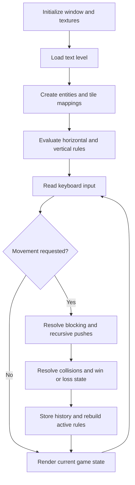
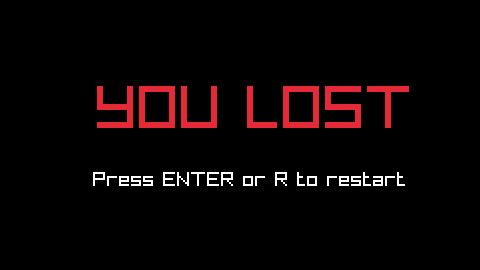
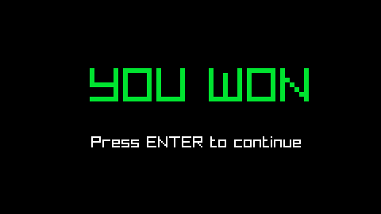
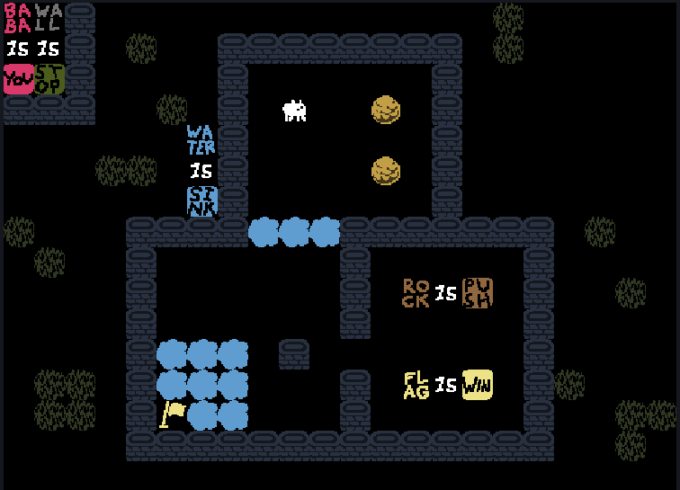

# Baba Mechanics Clone Educational

[](https://isocpp.org/)
[](https://www.raylib.com/)
[](https://www.gnu.org/software/make/)
[](https://www.doxygen.nl/)
[](https://github.com/cpplint/cpplint)

## Project description

This repository contains a playable C++ and raylib implementation of the core
mechanics behind **Baba Is You**. The current build loads eight text-based
levels, converts their symbols into runtime entities, evaluates rules formed by
movable word blocks, resolves movement and collisions, maintains undo history,
and renders the result from a sprite sheet.

The implementation is intentionally focused: it recreates the rule-driven
puzzle loop represented by the included levels rather than attempting to be a
complete port of every system in the commercial game. The project is organized
as a standalone software engineering codebase, with separate components for
application flow, level simulation, shared models, configuration, and symbol
translation.

This is a non-profit educational replica, created out of admiration for the
original game's design and technical creativity. Its source code was
independently implemented; the only material carried over from the original is
its visual assets and level designs, used solely for study and demonstration.
This project is not affiliated with or endorsed by Arvi Teikari or Hempuli Oy,
has no commercial purpose, and is not intended to replace the original game.

To experience the complete work and support its creator, please purchase the
[official game on Steam](https://store.steampowered.com/app/736260/Baba_Is_You/).

## Original game credit

*Baba Is You* was created by **Arvi Teikari (Hempuli)**. The game is developed
and published by **Hempuli Oy**.

All credit for the original concept, game design, characters, artwork, visual
assets, and level designs belongs to the original creator and their respective
rights holders.

- [Official Baba Is You website](https://www.hempuli.com/Baba/)
- [Official Baba Is You Steam page](https://store.steampowered.com/app/736260/Baba_Is_You/)

## Technology stack

| Technology | Role in the project |
|---|---|
| C++ | Entity modeling, rule evaluation, movement, and game-state logic |
| raylib | Window management, input handling, textures, and 2D rendering |
| GNU Make | Source discovery, compilation, linking, execution, and sanitizer targets |
| Doxygen | Documentation configuration and API-style source comments |
| cpplint | Automated C++ style validation through `make lint` |

## Implemented logic

### Level loading and entity model

Each level begins with its row and column count followed by a character grid.
`Level::loadLevel` reads that grid and creates one `Entity` for every recognized
symbol. An entity stores a unique ID, grid position, semantic type, display
symbol, and a map of active behavior tags. A separate tile-ID file maps symbols
to sprite-sheet positions.

### Dynamic rule evaluation

`Level::handleRules` rebuilds the active rule state whenever a level is loaded
or a successful move changes the board:

1. Existing behavior tags are reset, and instruction blocks become pushable.
2. Every `IS` block is inspected horizontally and vertically.
3. The cells immediately before and after `IS` are resolved through the noun
   and action dictionaries.
4. A noun-property rule, such as `BABA IS YOU`, activates a behavior tag on all
   matching entities.
5. A noun-noun rule, such as `WALL IS FLAG`, changes the matching entities'
   type and symbol at runtime.

The current simulation evaluates `IS YOU`, `IS PUSH`, `IS STOP`, `IS WIN`, and
`IS LOSE` behaviors. It also uses an internal `isBreak` tag for destructive
collisions.

### Movement and recursive pushing

Keyboard input is converted into a row and column offset. For each entity with
the `isYou` tag, the level examines every entity in the destination cell. A cell
with `isStop` and no pushable entity blocks movement. Pushable entities are
passed to `Level::tryPush`, which recursively validates the next cell before
moving an entire chain. The operation is rejected if any part of the chain
reaches the board boundary or a cell that resolves as blocked.

Before movement, the entity collection is copied as a snapshot. A successful
move stores that snapshot in a stack, allowing `Z` to restore the previous
board state.

### Interaction and state resolution

After movement, `Level::processRemove` checks entities that share a grid
position. It removes a player entity that touches an `isLose` entity and
resolves destructive `isBreak` collisions. The level enters the won state when
an `isYou` entity reaches an `isWin` entity, or the lost state when no `isYou`
entity remains.

The `Game` class owns the outer state machine. It keeps the application in one
of three states—`playing`, `won`, or `lost`—and controls level restarts and
progression to the next level.

### Rendering pipeline

Rendering is separated from rule evaluation. The current board is drawn in
layers: backgrounds, animated instruction blocks, interactive objects, the
goal flag, and finally the player-controlled entity. A frame counter cycles
through three adjacent sprite IDs to animate the instruction tiles. Cell size
and map offsets are calculated from the window dimensions so each level remains
centered on screen.

### Runtime flow



## Project structure

```text
.
├── assets/
│   ├── data/           # Level layouts and tile identifiers
│   ├── images/         # Sprite sheet used by the game
│   └── readmeImages/   # Images used by this document
├── src/
│   ├── config/         # Global configuration and constants
│   ├── game/           # Application lifecycle and main game loop
│   ├── level/          # Level loading, rules, movement, and rendering
│   ├── models/         # Shared data structures
│   ├── utilities/      # Entity and symbol utilities
│   └── main.cpp        # Program entry point
├── Doxyfile
└── makefile
```

| Component | Responsibility |
|---|---|
| `game` | Window lifecycle, top-level loop, and transitions between game states |
| `level` | Level parsing, rule evaluation, movement, interactions, history, and rendering |
| `models` | Entity, level, and sprite-sheet data structures |
| `utilities` | Translation from level characters to entity types and rule dictionaries |
| `config` | Shared constants, asset paths, display values, and state definitions |

## Building and running

The project requires a C++ compiler, GNU Make, raylib, and the native libraries
listed in the Makefile.

From the repository root, build and run the game with:

```bash
make clean
make
make run
```

Run the configured C++ linter with:

```bash
make lint
```

## Controls

| Key | Action |
|---|---|
| Arrow Up | Move north |
| Arrow Down | Move south |
| Arrow Right | Move east |
| Arrow Left | Move west |
| `R` | Restart the current level |
| `Z` | Undo the last movement |

## Gameplay

Rules follow the structure **subject**, **IS**, **property or object**. For
example, `ROCK IS PUSH` allows rocks to be pushed. Because rule blocks are
physical objects, moving one block can activate, disable, or transform a rule
while the level is being played.


A blocking rule can be dismantled to change navigation. If `WALL IS STOP` is
active, walls prevent movement; breaking the statement allows entities to pass
through them.


The game enters a loss state when no entity retains the `IS YOU` property.




A level is won when a player-controlled entity reaches an entity with the
`IS WIN` property.




## Text-based level format

Levels are stored as text grids. The first line defines the grid dimensions;
each following character represents an entity, instruction, or empty cell.

```text
16 22
BW#0000000000000h00000
II#0h00########0h00000
YS#0000#000000#0000000
###00h0#0*00$0#0000000
000000A#000000#0000000
000hh0I#0000$0#0000000
000000K#000000#0000000
h000####~~~#######0h00
0h00#000000#00000#0000
0000#000000#0RIP0#00h0
0000#000000#00000#0000
0000#~~~0#0000000#0000
0hh0#~~~000#0FIN0#h000
0hh0#&~~000#00000#00hh
0000##############00h0
0000000000000000000000
```



## Contributors

- **Jocsan Fernández** — [jocsan.fernandezsalas@ucr.ac.cr](mailto:jocsan.fernandezsalas@ucr.ac.cr)
- **Isaac Araya** — [isaac.arayaquesada@ucr.ac.cr](mailto:isaac.arayaquesada@ucr.ac.cr)
- **May Retana** — [may.retana@ucr.ac.cr](mailto:may.retana@ucr.ac.cr)

## Disclaimer

This repository is maintained strictly as a non-profit educational and
technical study. *Baba Is You* and all original material referenced or used by
this replica remain the property of their respective creator and rights
holders. No endorsement or official association is implied.
